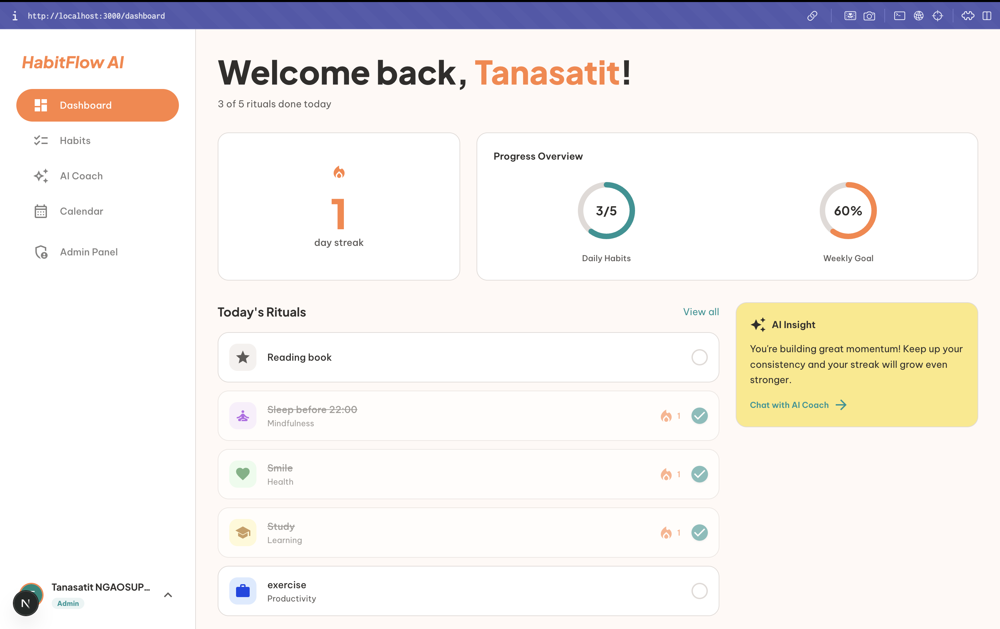
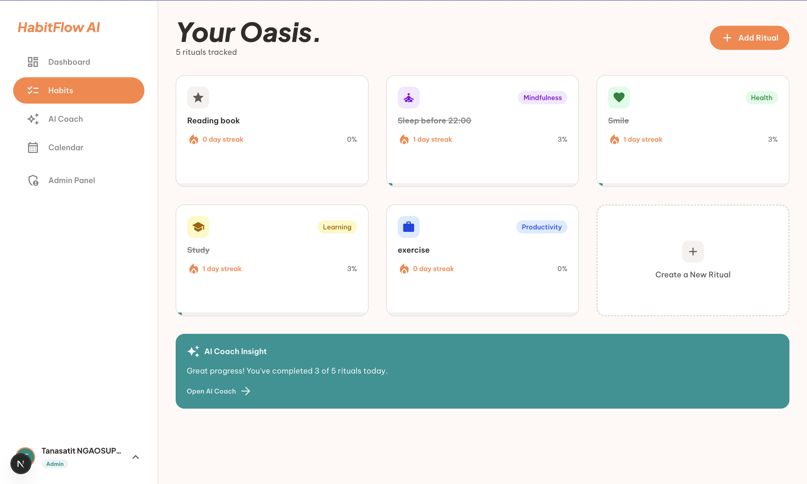
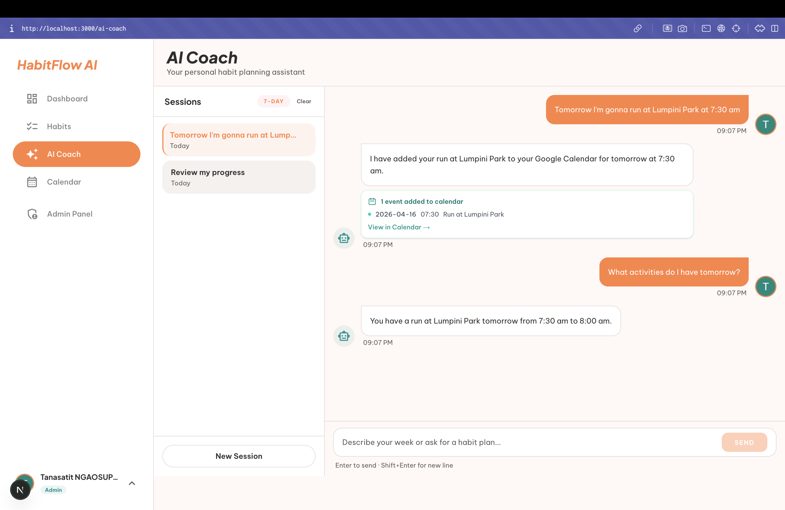
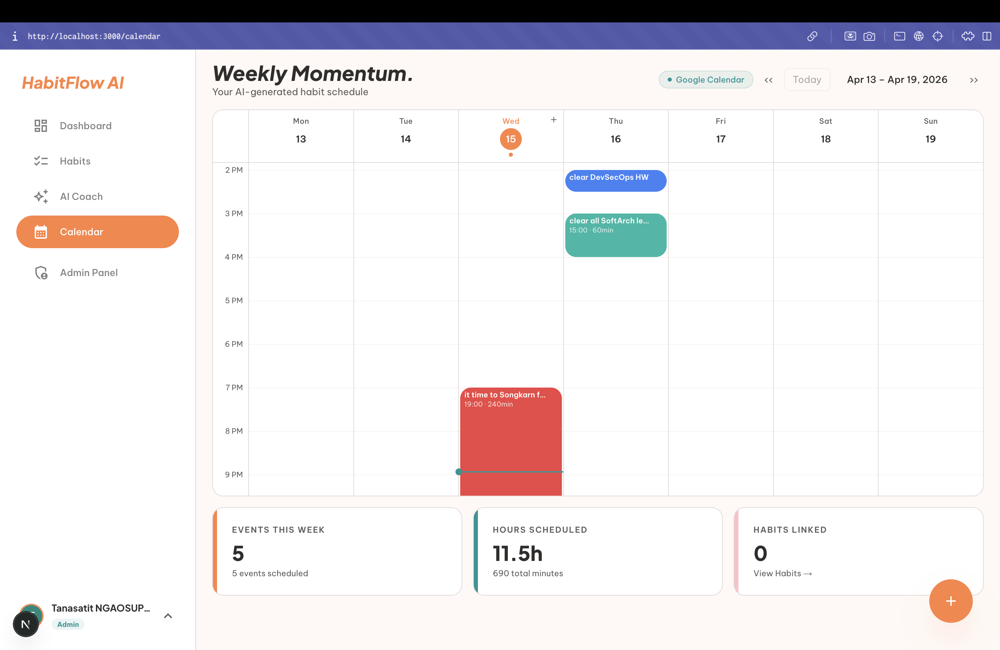
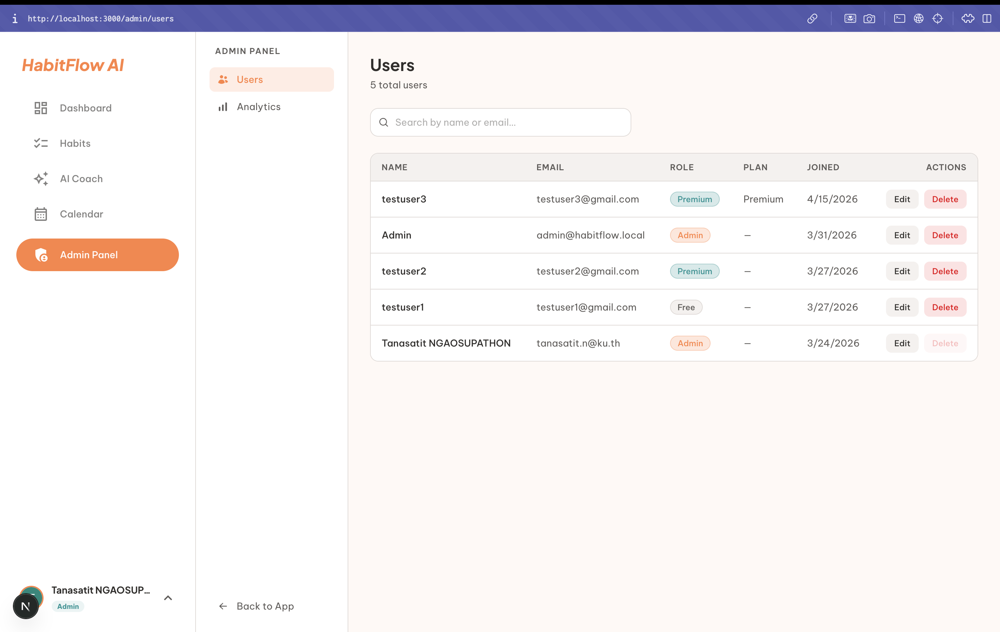

# HabitFlow AI

A web app where users describe their week in plain text → AI Coach builds a realistic habit plan → auto-fills a visual calendar.

---

## Table of Contents

1. [Project Description](#1-project-description)
2. [System Architecture Overview](#2-system-architecture-overview)
3. [User Roles & Permissions](#3-user-roles--permissions)
4. [Technology Stack](#4-technology-stack)
5. [Installation & Setup](#5-installation--setup)
6. [How to Run the System](#6-how-to-run-the-system)
7. [Screenshots](#7-screenshots)

---

## 1. Project Description

HabitFlow AI helps users build consistent habits by combining a simple tracking system with an AI-powered planning assistant.

**Core flow:**
1. A user describes their goals or weekly schedule in plain text
2. The AI Coach reads their existing habits and calendar, then proposes a habit plan
3. The user confirms, and the AI automatically schedules events on the visual calendar
4. Users check off habits daily to build streaks and earn points

**Key features:**
- Habit creation with category, frequency, and preferred time of day
- Daily completion tracking with streak and statistics
- Dashboard with weekly progress chart
- AI Coach chat with real-time streaming responses (SSE)
- AI can read and write both local and Google Calendar events
- Google Calendar OAuth2 integration for two-way sync
- Admin panel for user and subscription management

---

## 2. System Architecture Overview

HabitFlow uses a **Layered Monolith** with **Domain-Driven Design**. Each feature (user, habit, calendar, AI coach, etc.) is a self-contained package. There are no microservices — all domains share one process, one database connection, and one deployment unit.

### Request lifecycle

```
Browser (Next.js)
  │
  │  HTTPS  (JWT in httpOnly cookie)
  ▼
Go + Gin Backend  (:8080)
  │
  ├── Middleware: JWT validation + RBAC
  ├── Handler:    parse request, call service
  ├── Service:    business logic, orchestration
  └── Repository: GORM queries
        │
        ├── PostgreSQL (Supabase)   ← persistent data
        ├── Redis                   ← cache
        ├── Google Gemini API       ← AI inference
        └── Google Calendar API v3  ← calendar sync
```

### Backend domain packages

```
backend/internal/domain/
├── user/        ← register, login, JWT issuance
├── habit/       ← CRUD, streak calculation
├── calendar/    ← local calendar events
├── aicoach/     ← AI chat, SSE streaming, tool execution
├── dashboard/   ← stats aggregation
├── googleauth/  ← Google OAuth sign-in
├── googlecal/   ← Google Calendar read/write
└── admin/       ← user & subscription management
```

### AI Coach architecture

```
User sends message
  │
  ▼
Handler opens SSE response, spawns goroutine
  │
  ▼
Service loads conversation history (max 20 messages)
  │
  ▼
Gemini API (gemini-1.5-pro)
  │
  ├── Tool call requested?
  │     ├── get_user_habits        → query habits table
  │     ├── get_user_stats         → compute streaks
  │     ├── get_calendar_events    → query calendar_events
  │     ├── write_calendar_events  → insert into calendar_events
  │     ├── read_google_calendar   → call Google Calendar API
  │     └── write_google_calendar  → call Google Calendar API
  │
  └── Text tokens → streamed as SSE events to browser
```

If Gemini fails (quota exceeded), the backend retries via OpenRouter automatically.

---

## 3. User Roles & Permissions

There are three roles: **Free**, **Premium**, and **Admin**. Roles are encoded in the JWT and enforced by middleware on every protected route.

| Feature | Free | Premium | Admin |
|---|:---:|:---:|:---:|
| Register / Login | Yes | Yes | Yes |
| View own profile | Yes | Yes | Yes |
| Create habits (max 3) | Yes | Yes | Yes |
| Create habits (unlimited) | No | Yes | Yes |
| Log habit completion | Yes | Yes | Yes |
| View streak and stats | Yes | Yes | Yes |
| Dashboard | Yes | Yes | Yes |
| AI Coach chat | No | Yes | Yes |
| Local calendar | No | Yes | Yes |
| Google Calendar sync | No | Yes | Yes |
| View all users | No | No | Yes |
| Change user subscription | No | No | Yes |
| Delete user accounts | No | No | Yes |
| Platform analytics | No | No | Yes |

**How enforcement works:**

- Public routes (`/auth/register`, `/auth/login`, `/health`) require no token.
- All other routes require a valid JWT (`AuthMiddleware`).
- Premium routes (`/ai/chat`, `/calendar/*`, `/google/*`) additionally require `RequirePremium()` — passes if role is `premium` or `admin`.
- Admin routes (`/admin/*`) require `RequireRole("admin")`.
- A Free user who hits a premium endpoint receives HTTP 403.

---

## 4. Technology Stack

| Layer | Technology |
|---|---|
| Frontend | Next.js 14 (React 19 + TypeScript 5) |
| Styling | Tailwind CSS v4 |
| Animations | Framer Motion + GSAP |
| Backend | Go 1.25 + Gin Web Framework |
| ORM | GORM |
| Database | PostgreSQL via Supabase |
| Cache | Redis |
| AI / LLM | Google Gemini API (`gemini-1.5-pro`) + OpenRouter fallback |
| Calendar Sync | Google Calendar API v3 (OAuth2) |
| Containerization | Docker + Docker Compose |
| CI/CD | GitHub Actions |
| Hosting (backend) | Railway |
| Hosting (frontend) | Vercel |

---

## 5. Installation & Setup

### Prerequisites

- Go 1.25+
- Node.js 18+
- Docker + Docker Compose
- A [Supabase](https://supabase.com) project (free tier is fine)
- A [Gemini API key](https://aistudio.google.com)

### Clone the repo

```bash
git clone <repo-url>
cd HabitFlow
```

### Backend environment

```bash
cp .env.example .env
```

Open `.env` and fill in the required values:

| Variable | Description | How to get it |
|---|---|---|
| `PORT` | Server port | Leave as `8080` |
| `SUPABASE_DB_URL` | Postgres connection string | Supabase Dashboard → Settings → Database → URI |
| `JWT_SECRET` | Token signing key | `openssl rand -base64 32` |
| `JWT_EXPIRY_HOURS` | Token lifetime | Leave as `24` |
| `GEMINI_API_KEY` | LLM inference | [aistudio.google.com](https://aistudio.google.com) → Get API key |
| `GEMINI_MODEL` | Model name | Leave as `gemini-1.5-pro` |
| `OPENROUTER_API_KEY` | Fallback LLM (optional) | [openrouter.ai](https://openrouter.ai) |
| `REDIS_URL` | Cache | `redis://localhost:6379` for local dev |
| `FRONTEND_URL` | CORS origin | `http://localhost:3000` |
| `GOOGLE_IDENTITY_CLIENT_ID` | Google OAuth | Google Cloud Console → OAuth 2.0 Credentials |
| `GOOGLE_IDENTITY_CLIENT_SECRET` | Google OAuth | Same as above |
| `GOOGLE_IDENTITY_REDIRECT_URL` | OAuth callback | `http://localhost:8080/api/v1/auth/google/callback` |
| `GOOGLE_REDIRECT_URL` | Calendar OAuth callback | `http://localhost:8080/api/v1/google/callback` |
| `BACKEND_URL` | Public backend URL | `http://localhost:8080` |
| `ADMIN_EMAIL` | Seed admin account email | Any email |
| `ADMIN_PASSWORD` | Seed admin account password | Strong password |

### Frontend environment

```bash
cp frontend/.env.local.example frontend/.env.local
```

Set:

```
NEXT_PUBLIC_API_URL=http://localhost:8080/api/v1
```

---

## 6. How to Run the System

### Option A — Docker Compose (recommended)

Starts the backend and Redis together in containers.

```bash
docker compose up --build
```

Backend: `http://localhost:8080`  
Health check: `http://localhost:8080/api/v1/health`

Then start the frontend separately:

```bash
cd frontend
npm install
npm run dev
```

Frontend: `http://localhost:3000`

---

### Option B — Run locally without Docker

**Backend:**

```bash
cd backend
go run ./cmd/server
```

**Frontend (new terminal):**

```bash
cd frontend
npm install
npm run dev
```

---

### Running Tests

**Backend:**

```bash
cd backend

# All tests
go test ./...

# With coverage report
go test -cover ./internal/domain/habit/... ./internal/domain/user/...

# Verbose with race detector
go test -race -v ./...
```

Coverage targets: habit service ≥ 70%, user service ≥ 70%.

**Frontend:**

```bash
cd frontend

# Unit + component tests (44 tests)
npm test

# Watch mode
npm run test:watch
```

**End-to-end (Playwright):**

Requires a running backend on `localhost:8080`.

```bash
cd frontend

# Install browsers (first time only)
npx playwright install --with-deps chromium

# Run smoke test
npm run test:e2e
```

The smoke test registers a user, creates a habit, logs completion, and verifies the streak on the dashboard.

---

## 7. Screenshots

> Replace each placeholder image in `docs/screenshots/` with the real screenshot.

### Dashboard



### Habits



### AI Coach



### Calendar



### Admin Panel



---

## Project Structure

```
HabitFlow/
├── backend/
│   ├── cmd/server/        ← application entry point
│   ├── internal/
│   │   ├── domain/        ← handler / service / repository / model per feature
│   │   ├── middleware/    ← JWT auth + RBAC
│   │   └── ai/            ← Gemini client + tool definitions
│   ├── pkg/               ← config, database, response helpers
│   └── Dockerfile
├── frontend/
│   └── src/
│       ├── app/           ← Next.js App Router pages
│       ├── components/    ← UI + feature components
│       ├── lib/           ← API client, hooks
│       └── types/         ← TypeScript interfaces
├── docs/
│   ├── context/           ← architecture, database, roles, rules docs
│   ├── adr/               ← Architecture Decision Records
│   ├── prp/               ← Phase Requirement Plans
│   └── screenshots/       ← UI screenshots
├── docker-compose.yml
├── .env.example
├── report.md
└── README.md
```

---

## Development Phases

See [docs/context/PHASES.md](docs/context/PHASES.md) for the full roadmap.

| Phase | Description | Status |
|---|---|---|
| 1 | Project Setup | Done |
| 2 | Authentication | Done |
| 3 | Habits CRUD | Done |
| 4 | Dashboard & Streaks | Done |
| 5 | Admin Panel | Done |
| 6 | Calendar & AI Coach | Done |
| 7 | Google Calendar Sync | Done |
| 8 | Google OAuth (Sign in with Google) | Done |
| 9 | Enhance UX/UI | Done |
| 10 | Testing | Done |
| 11 | DevSecOps Pipeline | Pending |
| 12 | Polish & Submission | Pending |
